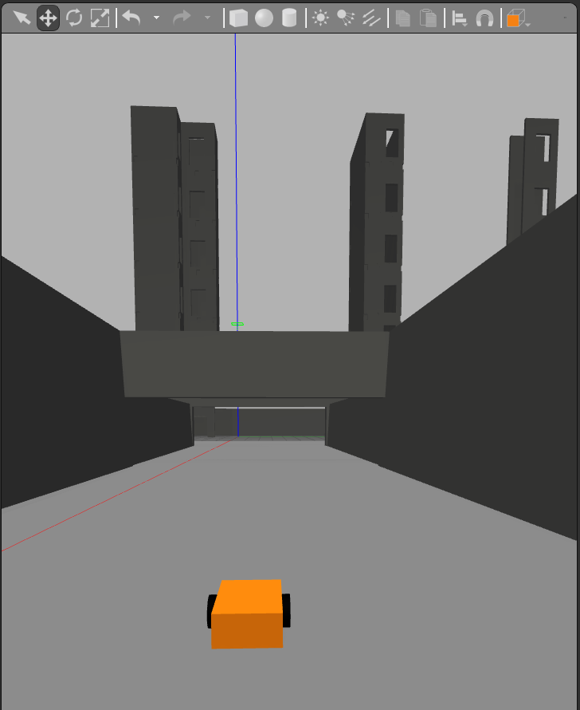
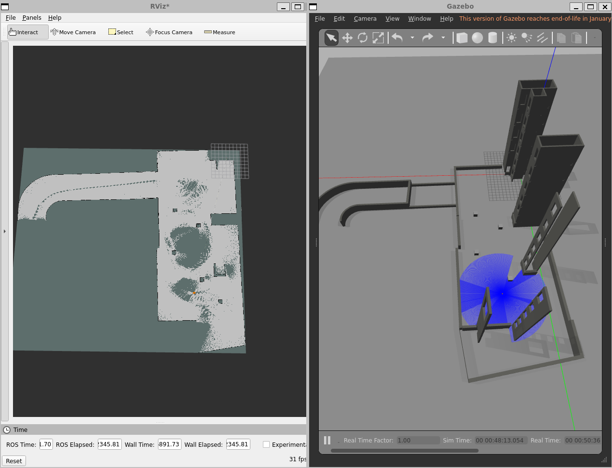

# BIM-Integrated Autonomous Mobile Robot (AMR) Simulation 🏗️🤖

## 📌 Project Overview
A ROS2-based autonomous mobile robot simulation for BIM (Building Information Modeling) virtual validation. The robot navigates a simulated construction site, localizes itself using AMCL, and performs precision alignment routines at target points.

## 🚧 Work in Progress
This project is currently in active development. 

## 🎯 Project Goals
1. ✅ Navigate a simulated construction site using a BIM-derived occupancy map
2. 🔄 Localize itself using AMCL (Adaptive Monte Carlo Localization)
3. ⏳ Navigate to target "alignment points" (e.g., column bases, wall corners)
4. ⏳ Perform an "alignment routine" — orienting itself precisely using simulated laser scan matching
5. ⏳ Publish a TF frame representing the "aligned" coordinate system

## 🏗️ What We've Built

### Phase 1: Gazebo + BIM Model Setup ✅
- Created 3D BIM mesh model (`BIM_Model1.dae`) and organized in Gazebo model folder
- Built valid `construction_site.sdf` with visual and collision properties
- Fixed URI paths using `model://Project_A/...`
- Configured `GAZEBO_MODEL_PATH` and launched Gazebo from WSL with ROS2 integration
- Custom BIM model correctly visualized in Gazebo world

### Phase 2: Robot Kinematics ✅
- Custom URDF (`construction_robot`) with differential drive system
- Two active wheels + one passive caster wheel
- `libgazebo_ros_diff_drive` plugin integration
- `/cmd_vel` active; robot responds to teleoperation
- Fixed wheel friction physics (`mu1=100`, `mu2=100`) for realistic traction

### Phase 3: Sensor Integration ✅
- **2D Lidar**: 360° Laser Range Finder publishing `/scan` (10Hz, 10m range)
  - Plugin: `libgazebo_ros_ray_sensor.so` with `sensor_msgs/LaserScan` output
  - Visualized in RViz2 with real-time wall detection
- **IMU**: Inertial Measurement Unit publishing `/imu` (100Hz)
  - Orientation, angular velocity, and linear acceleration data
  - Critical for SLAM and navigation accuracy

### Phase 4: SLAM Mapping ✅
- Installed and configured `slam_toolbox` for online asynchronous mapping
- Created custom teleoperation with arrow keys and speed control
- Built web bridge integration (`rosbridge_server`) for mobile/web app control
- Successfully mapped entire BIM construction site
- Saved occupancy grid map (`construction_site_map.pgm` + `.yaml`)

### Phase 5: AMCL Localization 🔄 (In Progress)
- Map server loading saved occupancy grid
- AMCL particle filter for robot pose estimation
- Initial pose setting via RViz2

## 🛠️ Current Features
- **BIM Integration:** Successful loading of large-scale (28MB+) architectural models with collision physics
- **Robot Kinematics:** Custom differential drive rover with functional caster wheel and realistic friction
- **Sensor Suite:** Lidar + IMU for environment perception and motion sensing
- **SLAM:** Real-time mapping using SLAM Toolbox with saved occupancy grid
- **Web Control:** Browser-based teleoperation via `rosbridge_server` WebSocket
- **ROS2 Architecture:** Clean package structure following industrial standards (URDF, SDF, Launch files)

## 🚀 How to Run

### 1. Build the workspace
    
    cd ~/ros2_ws
    colcon build --packages-select project_a_description
    source install/setup.bash

### 2. Launch simulation (Gazebo + Robot)
    
    ros2 launch project_a_description gazebo_launch.py

### 3. Launch SLAM (Mapping mode)

    ros2 launch project_a_description slam_launch.py

### 4. Teleoperate the robot

    Option A - Keyboard: ros2 run teleop_twist_keyboard teleop_twist_keyboard
    Option B - Web App: ros2 launch project_a_description web_bridge_launch.py
    # Then open your web app and connect to ws://YOUR_IP:9090

### 5. Save the map

    ros2 run nav2_map_server map_saver_cli -f construction_site_map

### 6. Launch Localization (AMCL)

    ros2 launch project_a_description localization_launch.py

📅 Roadmap

[x] Phase 1: Integrate BIM Mesh into Gazebo
[x] Phase 2: Configure Differential Drive Kinematics
[x] Phase 3: Add Lidar + IMU sensors
[x] Phase 4: Implement SLAM for mapping the BIM site
[ ] Phase 5: AMCL Localization with saved map
[ ] Phase 6: Autonomous Waypoint Navigation (Nav2)
[ ] Phase 7: Precision Alignment Routine + TF Frame Publishing

📝 Notes

Platform: ROS2 Humble on WSL2 (Ubuntu 22.04)
BIM model: 28MB .dae mesh with collision properties
Robot: 0.6m x 0.4m differential drive with 10m lidar range
Web app: Connects via rosbridge_server WebSocket on port 9090

🤝 Contributing
This is a personal learning project. Feel free to fork and experiment!